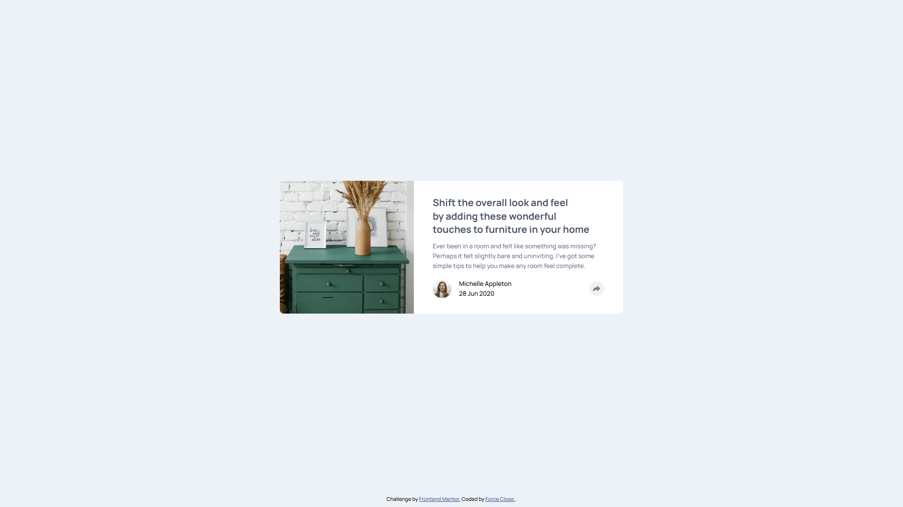

# Frontend Mentor - Article preview component solution

This is a solution to the [Article preview component challenge on Frontend Mentor](https://www.frontendmentor.io/challenges/article-preview-component-dYBN_pYFT). Frontend Mentor challenges help you improve your coding skills by building realistic projects.

## Table of contents

- [Overview](#overview)
  - [The challenge](#the-challenge)
  - [Screenshot](#screenshot)
  - [Links](#links)
- [My process](#my-process)
  - [Built with](#built-with)
  - [What I learned](#what-i-learned)
  - [Continued development](#continued-development)
  - [Useful resources](#useful-resources)
  - [AI Collaboration](#ai-collaboration)
- [Author](#author)

## Overview

### The challenge

Users should be able to:

- View the optimal layout for the component depending on their device's screen size.
- See the social media share links on a tooltip when they click the share icon.
- Close the tooltip seamlessly by clicking anywhere outside the share button.
- Experience smooth animations and transitions when the tooltip are opens and closes.
- Interact with a fully accessible component that utilizes `aria-hidden` and `inert` attributes for screen readers.

### Screenshot



### Links

- Solution URL: [solution URL](https://github.com/forceclosee/article-preview-component)
- Live Site URL: [live site URL](https://your-live-site-url.com) <!-- ganti link -->

## My process

### Built with

- Semantic HTML5 markup
- CSS custom properties
- Flexbox
- CSS Grid
- Modern CSS Features (Anchor Positioning, `@starting-style`, CSS Nesting)
- Mobile-first workflow
- Vanilla JavaScript

### What I learned

In this project, I learned and implemented several modern CSS features and useful JavaScript techniques:

- **CSS Anchor Positioning**
  I used CSS Anchor Positioning to dynamically position the tooltip relative to the share button on desktop screens. This makes positioning much easier without relying on complex calculations with absolute positioning.

```css
.share-button {
  anchor-name: --share-button;
}

@media (width >= 54rem) {
  .share-tooltip {
    position-anchor: --share-button;
    inset-block-end: calc(anchor(start) + 1rem);
    inset-inline-start: anchor(center);
    translate: -50% 0;
  }
}
```

- **Discrete Animations with `@starting-style`**
  Animating properties like `display` used to be very difficult with pure CSS. Here, I learned to use `@starting-style` and the `allow-discrete` keyword in the `transition` property to create a smooth fade-in/fade-out animation even when the element changes from / to `display: none`.

```css
.share-tooltip {
  transition:
    opacity 0.4s ease-in-out,
    display 0.4s ease-in-out allow-discrete;

  @starting-style {
    opacity: 0;
  }
}
```

- **Accessibility (`inert` & `aria-hidden`) and JS Event Management**
  To make the component more accessible to screen readers and keyboard users, I manipulated the `aria-hidden` attribute for the tooltip and added the `inert` attribute to background elements when the tooltip is open.

I also learned about event bubbling in JavaScript and used `e.stopPropagation()` when clicking the share button, preventing the global document event listener (which closes the tooltip) from triggering simultaneously.

```js
// prevent event bubbling
e.stopPropagation();
```

### Continued development

In future projects, I want to continue focusing on:

- **Advanced CSS Feature Fallbacks:** While CSS Anchor Positioning and `@starting-style` are incredibly powerful and make positioning and animating easier, browser support is still evolving. I plan to learn more about writing robust fallbacks using CSS feature queries (`@supports`) to ensure a consistent experience across all older browsers.
- **Accessibility (a11y) Best Practices:** Manually managing attributes like `inert` and `aria-hidden` in JavaScript was a great learning experience. I want to dive deeper into WCAG (Web Content Accessibility Guidelines) to ensure all my future interactive components are fully inclusive, especially regarding keyboard focus management.
- **State Management:** I'd like to explore translating this vanilla JavaScript DOM manipulation logic into a modern framework-based approach (like React, Vue, or Svelte) in future projects to see how declarative state management can simplify complex UI updates.

### Useful resources

- [Google Fonts](https://fonts.google.com/) - Provided the Overpass font family used throughout the project. A great free resource for web-safe fonts.
- [TinyPNG](https://tinypng.com/) - Helped me compress and optimize the images in the project without losing quality, making the page load faster.
- [Cloudinary](https://cloudinary.com/) - Used to host the Open Graph and Twitter card images for social media sharing.
- [Perfect Pixel](https://chrome.google.com/webstore/detail/perfectpixel-by-welldonec/dkaagdgjlophiddqccjgplachon0304v) - Chrome extension that allowed me to overlay the design mockup directly on my live page for pixel-perfect accuracy.
- [FontAwesome](https://fontawesome.com/) - A great library used for adding scalable vector icons easily throughout the project.

### AI Collaboration

In this project, I collaborated with an AI coding assistant (Gemini) to help refine and structure my documentation:

- **Documentation Formatting:** I used AI to help articulate my technical learnings, specifically around explaining modern CSS features like Anchor Positioning and `@starting-style` clearly.
- **Refining Phrasing:** The AI helped me refine the wording in the README file, ensuring that all technical concepts were communicated clearly and professionally.

Overall, this collaborative process proved to be highly effective. It significantly reduced the time I spent writing and formatting the documentation without compromising on quality or clarity. Furthermore, the process of explaining my technical decisions to the AI served as a valuable exercise, allowing me to think more critically and reflect deeply on the code I had just written.

## Author

- GitHub - [Force Close](https://github.com/forceclosee)
- Frontend Mentor - [@forceclosee](https://www.frontendmentor.io/profile/forceclosee)
- X - [@forceclosee](https://x.com/forceclosee)
